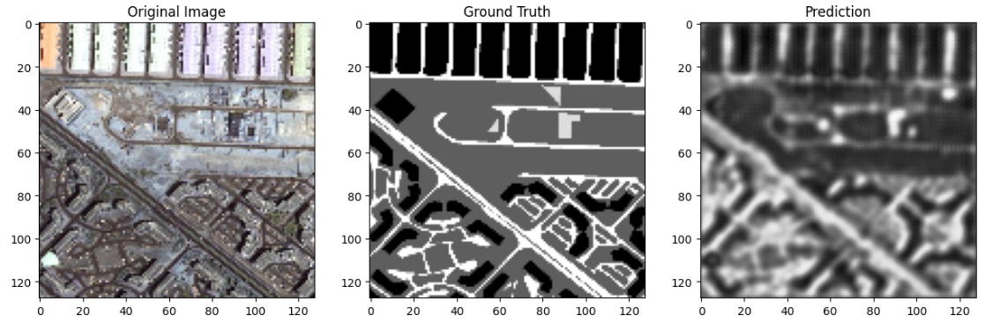

## U-Net Architecture with PyTorch

Input Image
     |
 Encoder (down)    →    Bottleneck    →    Decoder (up)

Encoder
-------
it behaves a normal CNN

Conv + ReLU + Pooling

Image size decreases, the number of channel increases

Decoder
-------
Upsampling is done with up-convolution layers (ConvTranspose2d)

Reduced feature maps are transformed back to the original shape again

Skip Connections
----------------
feature maps that come from the encoder are concatenate to corresponding layers in the decoder

___________________________________________________________________________________________________________________________________________________________________

-> [Dataset](https://www.kaggle.com/datasets/humansintheloop/semantic-segmentation-of-aerial-imagery)
